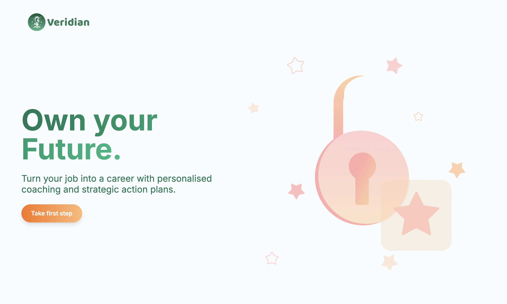

# Veridian Frontend: Social Mobility for Everyone
Welcome to the Veridian Frontend project! This is a [Next.js](https://nextjs.org/) application. Veridian is an AI-powered platform designed to transform jobs into meaningful careers by analyzing skills, creating personalized plans, and guiding users toward better opportunities.

## ✨ Developed at Llama Impact Hackathon – London ✨
This project was developed during the **Llama Impact Hackathon – London**, held from November 16-18 2024, as part of Meta’s Llama 3.1 Impact Grants program. The event, organized in partnership with **Meta, Cerebral Valley, Nebius, Neon, and Groq**, brought together innovative minds to create impactful projects.



## 🌐 Live Demo
Try out the live application at: (Veridian Frontend)[https://veridian-front-end.vercel.app/]


## 🚀 Getting Started
Follow these steps to run the project locally:

Prerequisites
Ensure you have the following installed:

- Node.js (LTS version recommended)
- npm, yarn, pnpm, or bun (for package management)

###  Installation

1. Clone the repository:

    ```
    git clone https://github.com/AlessioChen/Veridian-Front-End.git
    ```
2. Navigate to the project directory:

    ```
    cd veridian-frontend
    ```

3. Install dependencies

    ```
    npm install
    ``` 

4. Start the development server:

    ```
    npm run dev 
    ```

5. Open Your browswer and visit: [http://localhost:30000](http://localhost:3000)


## 🛠 Features
Skill Analysis
A user-friendly interface for uploading and reviewing skills and experiences.

## Goal Setting
Intuitive forms and dashboards for users to define career goals.

## Personalized Career Plans
Dynamic visualizations of AI-generated career paths tailored to user profiles.

## Progress Tracking
Interactive progress trackers to keep users informed and motivated.


## 🧰 Technologies Used
- Framework: React + Next.js
- Styling: Tailwind 
- APIs : Veridian Backend 
